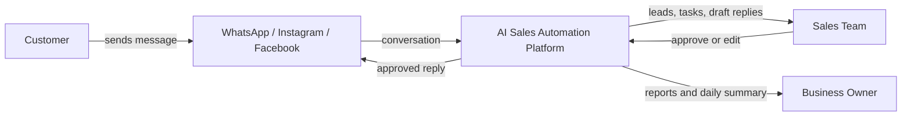
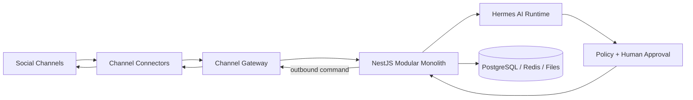
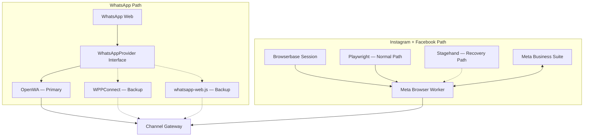
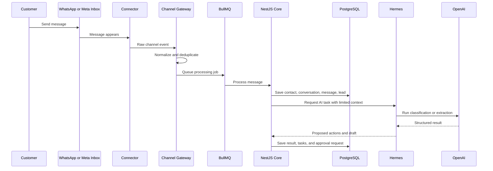
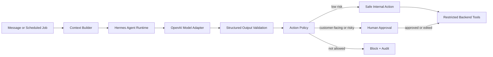
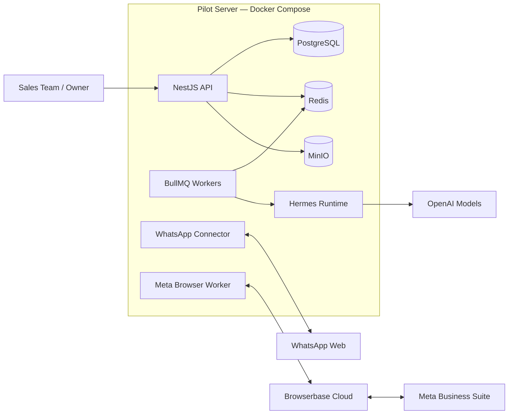

# AI Sales Automation Architecture

This repository explains the architecture of an **AI sales automation platform**.

It is not a UI project. It explains:

- what parts we need,
- what technology is used in each part,
- how a message moves through the system,
- where Hermes and OpenAI are used,
- how we keep browser automation controlled,
- and how we can replace unofficial connectors later.

---

## 1. Product idea

> An AI sales operator that watches WhatsApp, Instagram, and Facebook conversations, creates and updates leads, drafts replies, schedules follow-ups, and makes sure no sales opportunity is forgotten.

The first version starts with:

- WhatsApp,
- Instagram messages,
- Facebook messages,
- a NestJS modular monolith,
- Hermes as the agent runtime,
- OpenAI as the first model provider,
- Browserbase for browser sessions,
- Playwright for stable browser steps,
- Stagehand when the page changes,
- OpenWA as the first WhatsApp provider.

---

# Architecture Views

Instead of one huge diagram, the architecture is split into six views.

Each view answers one question.

---

## View 1 — Who uses the system?

This is the highest-level view.



### What this means

The platform sits between social inboxes and the sales team.

It does four main jobs:

1. Capture conversations.
2. Turn conversations into organized sales data.
3. Let AI suggest the next action.
4. Send only approved customer-facing actions.

---

## View 2 — What are the main runtime parts?



### Main rule

> Connectors move messages. The core application owns the business data.

If OpenWA, Browserbase, or a browser session stops working, contacts, leads, tasks, approvals, reports, and old conversations stay safe in PostgreSQL.

---

## View 3 — How do channel connectors work?



### WhatsApp

The core does not call OpenWA directly.

It calls a provider interface:

```ts
interface WhatsAppProvider {
  connect(accountId: string): Promise<void>;
  sendMessage(input: SendMessageInput): Promise<SendMessageResult>;
  getHealth(accountId: string): Promise<ConnectorHealth>;
}
```

Provider order for the MVP:

1. OpenWA.
2. WPPConnect.
3. `whatsapp-web.js`.
4. Manual open-in-WhatsApp fallback.
5. Official API later when the product has enough revenue.

### Instagram and Facebook

The Meta Browser Worker uses:

| Tool | Job |
|---|---|
| Browserbase | Hosts the browser session and keeps one isolated login context per company |
| Playwright | Runs stable steps such as opening the inbox, reading messages, typing, and sending |
| Stagehand | Helps when selectors or page layout change |
| Meta Browser Worker | Owns the restricted workflow and sends normalized events to the backend |

The rule is:

> Playwright first. Stagehand only when the fixed flow fails.

Stagehand helps with browser interaction. It does not decide prices, discounts, lead stages, or sales strategy.

---

## View 4 — What happens when a message arrives?



### Inbound steps

1. A connector reads the new message.
2. The Channel Gateway converts it into one common format.
3. The gateway creates an idempotency key so the same message is not processed twice.
4. BullMQ runs the processing job.
5. The core saves the conversation.
6. Hermes receives only the context needed for the current task.
7. The AI result is validated before anything changes.
8. The core creates or updates leads, tasks, and approval requests.

### Common message shape

```ts
type NormalizedMessage = {
  tenantId: string;
  channel: "whatsapp" | "instagram" | "facebook";
  channelAccountId: string;
  externalConversationId: string;
  externalMessageId: string;
  senderId: string;
  senderName?: string;
  direction: "inbound" | "outbound";
  type: "text" | "image" | "audio" | "video" | "file";
  text?: string;
  attachmentUrl?: string;
  occurredAt: string;
};
```

After this point, the CRM does not care whether the message came from OpenWA or from a browser.

---

## View 5 — How does AI approval work?



### Hermes and OpenAI are not the same thing

| Part | Job |
|---|---|
| Hermes | Runs the agent workflow, selects tools, keeps task state, and returns proposed actions |
| OpenAI | Provides the language models used for classification, extraction, reasoning, and drafting |
| Context Builder | Selects only the relevant company data and conversation history |
| Validator | Checks that the model output matches the expected schema |
| Policy Engine | Decides whether an action is automatic, needs approval, or is blocked |
| Restricted Tool Gateway | Executes only backend commands that we explicitly allow |

### Risk levels

| Risk | Examples | MVP policy |
|---|---|---|
| Low | Classify, tag, summarize, create internal task | Automatic with audit |
| Medium | Move lead stage, assign employee, schedule follow-up | Validation or approval |
| High | Send customer reply, appointment, quotation | Human approval |
| Critical | Discount, refund, cancellation, legal complaint | Human-only |

Hermes does not receive:

- browser cookies,
- customer passwords,
- database credentials,
- unrestricted browser control,
- another tenant's data.

It works through restricted tools such as:

```ts
createLead();
updateLeadFields();
moveLeadStage();
createFollowUpTask();
requestReplyApproval();
queueApprovedReply();
```

---

## View 6 — How is the MVP deployed?



### Why Docker Compose first?

The first pilot does not need Kubernetes.

Docker Compose is enough for:

- one NestJS API,
- background workers,
- PostgreSQL,
- Redis,
- MinIO,
- Hermes,
- WhatsApp connector processes,
- Meta browser workers.

The browser and WhatsApp workers stay in separate processes because they can crash, consume more memory, or require re-login without taking down the core application.

---

# Core Application Modules

The backend is one **NestJS modular monolith**.

| Module | Owns |
|---|---|
| Auth and Tenant | Companies, users, roles, permissions, connected accounts |
| Contacts | Customer identity, phone numbers, handles, and channel profiles |
| Conversations | Threads, messages, attachments, unread state, and assignment |
| Leads and Pipeline | Stage, score, expected value, owner, and lost reason |
| Tasks and Follow-ups | Reminders, scheduled actions, and overdue work |
| Company Knowledge | Services, FAQs, rules, approved prices, tone, and working hours |
| Approval Queue | AI actions waiting for approve, edit, or reject |
| Message Outbox | Reliable sending, retries, and delivery state |
| Reports | Activity, missed leads, response time, and daily business brief |

### Why a modular monolith?

- Faster to build.
- Easier database transactions.
- Easier to change during customer validation.
- Fewer deployments.
- Clear modules can still become services later.

---

# Technology Map

| Area | Technology | Why we use it |
|---|---|---|
| Backend | NestJS with Fastify | Clear modules, dependency injection, workers, and WebSockets |
| Language | TypeScript | Shared types across API, workers, and connectors |
| Database | PostgreSQL | Main relational source of truth |
| ORM | Prisma | Schema, migrations, and TypeScript types |
| Queue and cache | Redis + BullMQ | Jobs, retries, locks, and delayed follow-ups |
| WhatsApp primary | OpenWA | Fast MVP without paying for the official API |
| WhatsApp backups | WPPConnect, `whatsapp-web.js` | Avoid depending on one library only |
| Browser hosting | Browserbase | Managed sessions, isolated contexts, and debugging |
| Browser automation | Playwright | Stable and testable repeated steps |
| Browser recovery | Stagehand | Helps when page layout or selectors change |
| Agent runtime | Hermes | Runs the AI workflow and controlled tool calls |
| Model provider | OpenAI first | Classification, extraction, reasoning, and reply drafting |
| File storage | MinIO locally | Easy S3-compatible attachment storage |
| Local deployment | Docker Compose | Simple pilot infrastructure |

---

# Reliability Rules

## Connector failure must not break the CRM

A connector can be:

- connected,
- degraded,
- login required,
- blocked by challenge,
- disconnected.

When a connector fails:

- business data stays available,
- unsent replies stay in the Outbox,
- retries stop safely,
- the employee gets an alert,
- the employee can open the original inbox manually.

## Multi-tenant isolation

Every record includes a `tenantId`.

Each company has:

- separate connected accounts,
- separate browser context,
- separate company knowledge,
- separate permissions,
- separate AI task context,
- separate audit records.

The model never chooses the tenant. The backend resolves and validates the tenant before the AI task starts.

---

# Architecture as Code

The architecture source of truth is here:

- [`architecture/workspace.dsl`](architecture/workspace.dsl) — Structurizr C4 model.
- [`architecture/d2/`](architecture/d2/) — editable D2 presentation views.
- [`decisions/`](decisions/) — Architecture Decision Records.
- [`docs/`](docs/) — detailed architecture notes.

Structurizr stores the architecture model. The smaller GitHub diagrams in this README make the architecture easy to review without opening another tool.

---

# MVP Scope

## Included

- WhatsApp connection through OpenWA.
- WPPConnect technical fallback test.
- Instagram and Facebook through Meta Business Suite browser automation.
- Browserbase session per tenant.
- Playwright stable flows.
- Stagehand recovery experiment.
- Unified normalized messages.
- Contacts, conversations, leads, pipeline, and tasks.
- Hermes classification, extraction, drafting, and follow-up planning.
- Human approval for customer-facing replies.
- Outbox, retries, audit logs, and health monitoring.
- Daily AI sales summary.

## Not included yet

- Microservices.
- Kubernetes.
- Full autonomous replies.
- Bulk cold outreach.
- TikTok.
- Official messaging APIs.
- Complex billing.
- Marketplace integrations.

---

# First Technical Spikes

1. Receive one WhatsApp message through OpenWA.
2. Convert it into `NormalizedMessage`.
3. Save it safely with idempotency.
4. Send one WhatsApp reply through the Outbox.
5. Open Meta Business Suite through Browserbase.
6. Read one Instagram or Facebook conversation using Playwright.
7. Test Stagehand after intentionally breaking a selector.
8. Send a message to Hermes with limited context.
9. Return structured lead data.
10. Create an approval request.
11. Send the approved reply through the correct connector.
12. Test connector failure and manual fallback.

---

# Review Workflow

Architecture changes happen through a branch and Pull Request.

1. Change the Structurizr model or a D2 view.
2. Update the related ADR when a decision changes.
3. Review the diagram and text in the Pull Request.
4. Merge only after the architecture is accepted.
