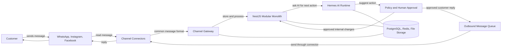
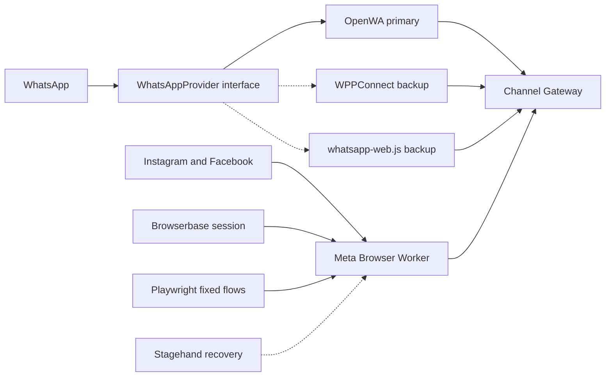
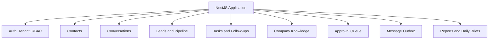
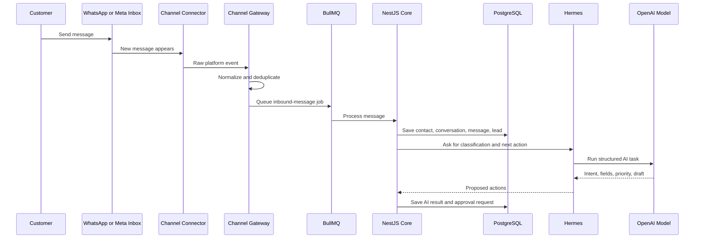
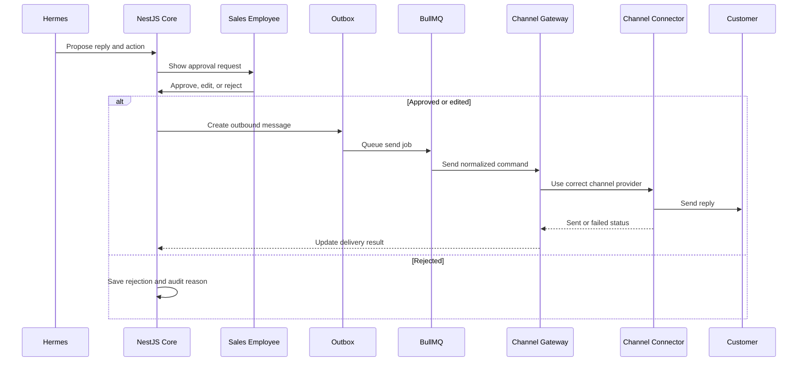
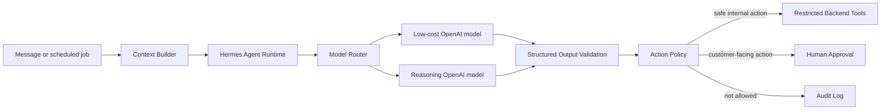
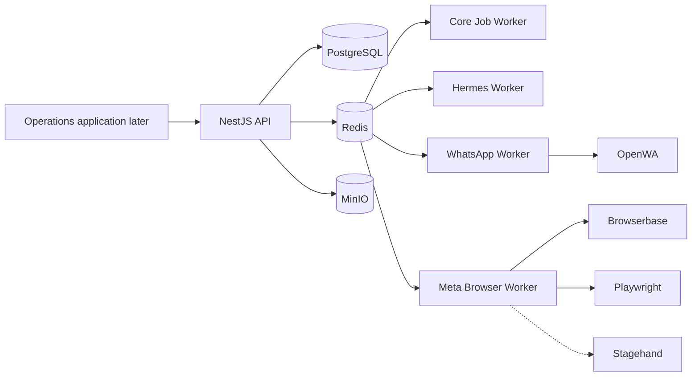

# AI Sales Automation Architecture

This repository describes the backend architecture for an **AI sales automation platform**.

The product connects to WhatsApp, Instagram, and Facebook, stores every conversation, creates and updates leads, lets Hermes understand what the customer wants, and prepares the next sales action.

This is an architecture repository, not a UI design repository.

---

## 1. The product in one sentence

> An AI sales operator that watches business conversations, creates leads, drafts replies, schedules follow-ups, and makes sure no sales opportunity is forgotten.

---

## 2. The architecture in one picture

This is the main diagram. It only shows the important path.



### How to read it

1. The customer sends a message on WhatsApp, Instagram, or Facebook.
2. A connector reads the message.
3. The Channel Gateway converts it into one common format.
4. The NestJS application stores the conversation and updates the lead.
5. Hermes receives only the context needed for the task.
6. Hermes uses OpenAI models to classify, extract, reason, and draft.
7. Safe internal actions may run automatically.
8. Customer-facing actions require approval in the MVP.
9. Approved replies go to the Outbox and return through the same connector.

The main rule is:

> Connectors move messages. The core application owns the business data.

If OpenWA, Browserbase, or a social session stops working, contacts, leads, tasks, approvals, reports, and old conversations remain safe in the core database.

---

## 3. What is inside each block

### A. Customer channels

The MVP starts with:

- WhatsApp.
- Instagram messages.
- Facebook messages.

Instagram and Facebook are accessed through Meta Business Suite in a browser session.

---

### B. Channel connectors

The connector layer hides how each platform is accessed.



#### WhatsApp connector

**Primary:** OpenWA.

**Backups:** WPPConnect, then `whatsapp-web.js`.

All providers implement the same application interface:

```ts
interface WhatsAppProvider {
  connect(accountId: string): Promise<void>;
  disconnect(accountId: string): Promise<void>;
  sendMessage(input: SendMessageInput): Promise<SendMessageResult>;
  getHealth(accountId: string): Promise<ConnectorHealth>;
}
```

The core never imports OpenWA directly. It only knows `WhatsAppProvider`.

This means we can replace the library later without rebuilding the CRM.

#### Meta browser connector

The Meta connector uses four parts:

| Part | Job |
|---|---|
| Browserbase | Hosts the browser session and keeps a separate login context for each company |
| Playwright | Runs stable repeated steps such as opening the inbox, reading unread messages, typing, and sending |
| Stagehand | Helps when selectors or page layouts change |
| Meta Browser Worker | Owns the complete restricted workflow and sends normalized events to our backend |

The rule is:

> Playwright first. Stagehand only when the fixed flow cannot understand the current page.

Stagehand does not make sales decisions. It only helps the browser worker complete a browser task.

---

### C. Channel Gateway

The Channel Gateway is the border between external platforms and our product.

Its job is to:

- Receive events from every connector.
- Verify the tenant and connected account.
- Convert every message into one common shape.
- Detect duplicate events.
- Store an idempotency key.
- Put background work into BullMQ.
- Route outbound messages to the correct provider.

Example normalized message:

```ts
type NormalizedMessage = {
  tenantId: string;
  channel: "whatsapp" | "instagram" | "facebook";
  channelAccountId: string;
  externalConversationId: string;
  externalMessageId: string;
  senderId: string;
  senderName?: string;
  direction: "inbound" | "outbound";
  type: "text" | "image" | "audio" | "video" | "file";
  text?: string;
  attachmentUrl?: string;
  occurredAt: string;
};
```

After normalization, the rest of the application does not need to know whether a message came from OpenWA or a browser.

---

### D. NestJS modular monolith

The first version is one deployable backend application with clear internal modules.



#### Modules

| Module | Owns |
|---|---|
| Auth and Tenant | Companies, users, roles, permissions, connected accounts |
| Contacts | Customer identity, phone numbers, handles, channel profiles |
| Conversations | Threads, messages, attachments, unread state, assignments |
| Leads and Pipeline | Lead stage, score, value, owner, lost reason |
| Tasks and Follow-ups | Reminders, scheduled actions, overdue work |
| Company Knowledge | Services, FAQs, rules, approved prices, tone, working hours |
| Approval Queue | AI actions waiting for approve, edit, or reject |
| Message Outbox | Reliable outbound sends, retries, and delivery state |
| Reports | Sales activity, missed leads, response time, daily business brief |

#### Why monolith first

- Faster to build.
- Easier database transactions.
- Easier to change the sales workflow during validation.
- Fewer deployments and fewer network failures.
- Modules can still be separated later.

OpenWA workers, browser workers, and Hermes run as separate processes because they have different failure and scaling behavior.

---

## 4. Inbound message flow

This diagram shows only what happens when a customer sends a message.



### Example

Customer message:

> I have a 180 m² apartment in New Cairo and need finishing in three months.

The AI result may be:

```json
{
  "intent": "request_quote",
  "service": "full_finishing",
  "location": "New Cairo",
  "areaM2": 180,
  "timeline": "3 months",
  "priority": "high",
  "missingFields": ["budget", "finishing_level"],
  "nextAction": "ask_qualification_questions"
}
```

The application then:

- Creates or updates the contact.
- Creates a lead.
- Saves the extracted fields.
- Adds the lead to the correct pipeline stage.
- Creates a draft reply.
- Requests approval when the reply will be sent to the customer.

---

## 5. Outbound reply flow

This diagram shows only how an approved reply is sent.



The connector never chooses what to say. It only sends an already approved command.

---

## 6. Hermes and OpenAI

Hermes and OpenAI have different jobs.



### Hermes

Hermes runs the automation workflow.

It can:

- Classify messages.
- Extract lead data.
- Draft replies.
- Plan follow-ups.
- Summarize conversations.
- Detect forgotten leads.
- Generate daily briefs.
- Call restricted backend tools.

Hermes cannot directly access:

- Browser cookies.
- Customer passwords.
- Raw database credentials.
- Arbitrary websites.
- Shell commands.
- Another tenant's data.

### OpenAI

OpenAI provides language models used by Hermes.

We use a provider adapter so the core is not tied to one model name:

```ts
interface AIModelProvider {
  runStructuredTask<T>(input: ModelTaskInput): Promise<T>;
}
```

The model router chooses:

- A cheaper model for simple classification and extraction.
- A stronger model for unclear or high-value conversations.

---

## 7. AI action safety

Every AI action has a risk level.

| Risk | Examples | MVP policy |
|---|---|---|
| Low | Tag message, classify lead, summarize, create internal task | Automatic with audit |
| Medium | Change stage, assign employee, schedule follow-up | Automatic only with strong validation or approval |
| High | Send reply, offer appointment, send quotation | Human approval |
| Critical | Discount, refund, cancellation, legal complaint | Human-only |

The AI works through a restricted tool gateway:

```ts
createLead();
updateLeadFields();
moveLeadStage();
createFollowUpTask();
requestReplyApproval();
queueApprovedReply();
```

Every tool call is checked by the backend for:

- Tenant ID.
- User or automation identity.
- Allowed action.
- Valid arguments.
- Current lead and conversation state.
- Required approval.

---

## 8. Data ownership

### PostgreSQL

PostgreSQL is the source of truth for:

- Tenants.
- Users and roles.
- Connected channel accounts.
- Contacts.
- Conversations and messages.
- Leads and stages.
- Tasks and follow-ups.
- Approvals.
- Outbox messages.
- AI runs and audit logs.

### Redis and BullMQ

Redis and BullMQ handle:

- Inbound message jobs.
- AI jobs.
- Outbound send jobs.
- Retries.
- Delayed follow-ups.
- Connector health checks.
- Idempotency locks.

Redis is not the source of truth. Important state remains in PostgreSQL.

### MinIO or S3-compatible storage

Used for:

- Images.
- Voice notes.
- Videos.
- Documents.
- Optional browser debug screenshots.

Only metadata and secure object references are stored in PostgreSQL.

---

## 9. Tenant isolation

Every important record contains a `tenantId`.

Each company has separate:

- Users and permissions.
- WhatsApp sessions.
- Browserbase contexts.
- Channel accounts.
- Company knowledge.
- Conversations and leads.
- AI context.
- Usage and cost records.

A browser worker receives only one tenant and one connected account for each job.

Hermes receives a prepared context from the backend. It does not search the complete database by itself.

---

## 10. Runtime and deployment

The MVP uses Docker Compose.



### Processes

1. **NestJS API** — business API and modular monolith.
2. **Core Job Worker** — inbound processing, reports, scheduled tasks.
3. **Hermes Worker** — AI automation runs.
4. **WhatsApp Worker** — OpenWA sessions and WhatsApp commands.
5. **Meta Browser Worker** — Browserbase, Playwright, and Stagehand tasks.
6. **PostgreSQL** — durable business data.
7. **Redis** — queues, locks, and temporary cache.
8. **MinIO** — local attachment storage.

We are not using Kubernetes or microservices in the MVP.

---

## 11. Technology map

| Area | Technology | Where it is used | Why |
|---|---|---|---|
| Backend | NestJS with Fastify | Main application | Clear modules, dependency injection, workers, WebSockets |
| Language | TypeScript | Core and connectors | Shared contracts and safer refactoring |
| Database | PostgreSQL | Business source of truth | Transactions and relational data |
| ORM | Prisma | Core data access | Schema, migrations, TypeScript types |
| Queue | BullMQ | Background processing | Retries, schedules, delayed jobs |
| Queue storage | Redis | Workers and locks | Fast temporary coordination |
| WhatsApp | OpenWA | WhatsApp worker | Fast MVP without official API cost |
| WhatsApp backup | WPPConnect | Provider fallback | Reduces dependency on one library |
| WhatsApp backup 2 | whatsapp-web.js | Provider fallback | Third implementation option |
| Browser hosting | Browserbase | Meta browser sessions | Managed sessions, contexts, debugging |
| Browser automation | Playwright | Meta browser worker | Stable and testable repeated actions |
| Browser recovery | Stagehand | Meta browser worker | Semantic recovery when the page changes |
| Agent runtime | Hermes | AI worker | Agent workflow, tools, memory, reasoning |
| Model provider | OpenAI | Called through Hermes | Classification, extraction, drafting, reasoning |
| File storage | MinIO then S3-compatible | Attachments | Portable object storage |
| Local deployment | Docker Compose | Development and pilots | Simple and repeatable |
| Observability | Structured logs and OpenTelemetry-compatible tracing | All processes | Debug connector and AI failures |

---

## 12. Connector fallback strategy

```text
WhatsApp:
OpenWA
  -> WPPConnect
  -> whatsapp-web.js
  -> manual open-in-WhatsApp fallback
  -> official adapter later

Instagram and Facebook:
Playwright fixed flow
  -> Stagehand recovery
  -> human login or intervention
  -> manual open-in-Meta fallback
  -> official Meta adapter later
```

Using several unofficial WhatsApp libraries protects us from one library-specific failure. It does not remove all risk caused by changes in WhatsApp Web itself.

---

## 13. MVP scope

The first usable version includes:

- WhatsApp connection through OpenWA.
- Instagram and Facebook through Meta Business Suite browser automation.
- Unified normalized conversation storage.
- Contacts and lead pipeline.
- AI classification and lead extraction.
- AI reply drafting.
- Human approval before customer replies.
- Tasks and follow-ups.
- Outbound message queue with retries.
- Daily sales summary.
- Audit log for AI and outbound actions.
- Connector health status.
- Manual fallback links.

Not included in the first version:

- Kubernetes.
- Microservices.
- Fully autonomous sales replies.
- Bulk outreach.
- Every social network.
- Automatic discounts, refunds, or cancellations.
- Official platform APIs unless required for a pilot.

---

## 14. Build order

1. Create NestJS project with tenant, contact, conversation, and lead modules.
2. Add PostgreSQL and Prisma.
3. Add Redis and BullMQ.
4. Define `NormalizedMessage` and connector interfaces.
5. Build OpenWA spike: receive and send one message.
6. Add idempotency and message persistence.
7. Build Browserbase login and context spike.
8. Read Meta unread conversations with Playwright.
9. Add Stagehand fallback for one changed page state.
10. Connect Hermes to one restricted task.
11. Use OpenAI structured output to extract lead data.
12. Build approval and outbound message flow.
13. Add connector health and manual fallback.
14. Run an end-to-end pilot with one company.

---

## 15. Detailed documents

- [`00 - Scope and principles`](docs/00-scope-and-principles.md)
- [`01 - System context`](docs/01-system-context.md)
- [`02 - Container architecture`](docs/02-container-architecture.md)
- [`03 - Message lifecycle`](docs/03-message-lifecycle.md)
- [`04 - Hermes AI automation runtime`](docs/04-ai-automation-runtime.md)
- [`05 - Selected technology map`](docs/05-selected-technology-map.md)

Architecture decisions:

- [`ADR-001 - Launch channels`](decisions/ADR-001-launch-channels.md)
- [`ADR-002 - Modular monolith`](decisions/ADR-002-modular-monolith.md)
- [`ADR-003 - Hermes runtime`](decisions/ADR-003-hermes-agent-runtime.md)
- [`ADR-004 - Browserbase runtime`](decisions/ADR-004-browserbase-runtime.md)
- [`ADR-005 - WhatsApp connectors`](decisions/ADR-005-whatsapp-connectors.md)

---

## 16. Collaboration workflow

1. Architecture changes are made on a branch.
2. Every meaningful change is reviewed in a Pull Request.
3. Important technology choices are recorded as ADRs.
4. Mermaid diagrams stay editable as text.
5. A decision is merged only after review.