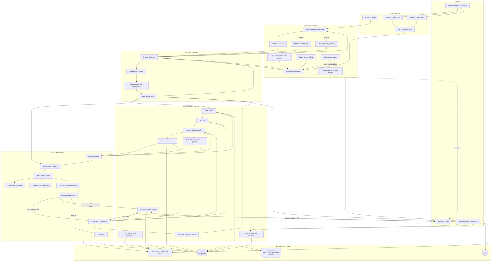
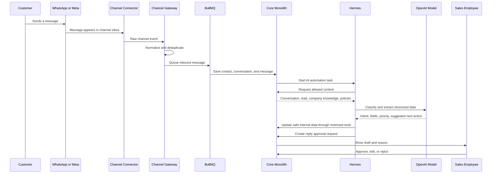
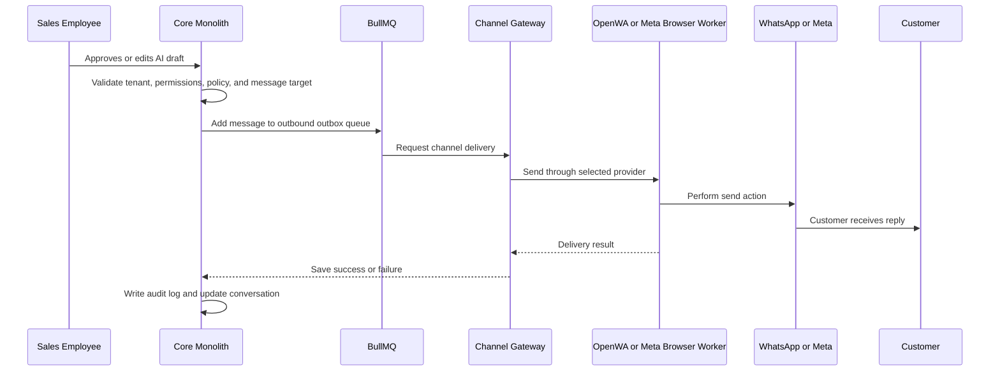
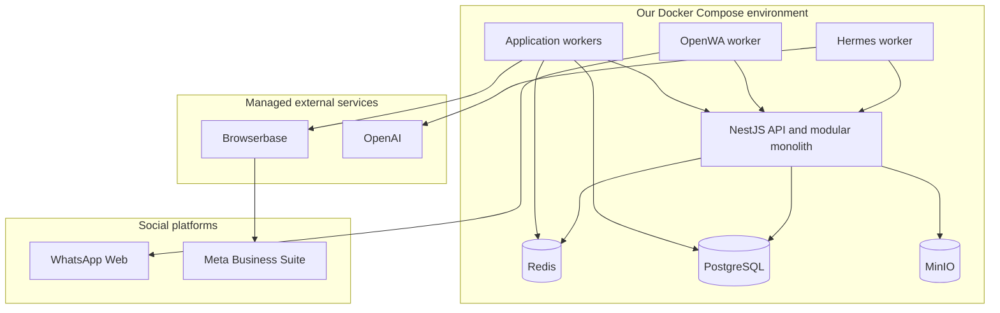

# AI Sales Automation Architecture

This repository explains the backend architecture for an **AI sales automation platform**.

The product connects to WhatsApp, Instagram, and Facebook, collects customer messages, turns them into leads, lets Hermes understand the conversation, and prepares the next sales action.

This is **not a UI design repository**. It explains:

- What services we need.
- Which technology is used in each place.
- Why each technology was selected.
- How messages move through the system.
- Where AI is allowed to act.
- How we keep customer accounts and company data isolated.
- How we can replace unofficial connectors later without rebuilding the product.

---

## 1. Product in one sentence

> An AI sales operator that watches WhatsApp, Instagram, and Facebook conversations, creates and updates leads, drafts replies, schedules follow-ups, and makes sure sales opportunities are not forgotten.

The AI does not get unlimited access to customer accounts. It works through controlled tools owned by our backend.

---

## 2. MVP decisions

| Area | MVP decision | Why |
|---|---|---|
| Launch channels | WhatsApp + Instagram + Facebook | They cover the main customer conversations for the first target businesses |
| Backend shape | NestJS modular monolith | Faster to build and change than microservices while keeping clear module boundaries |
| WhatsApp access | OpenWA first | Fast way to validate the product without paying for the official API |
| WhatsApp backup | WPPConnect, then `whatsapp-web.js` | Avoid depending on one open-source library only |
| Meta access | Meta Business Suite through a browser session | One logged-in inbox can cover Instagram and Facebook without platform messaging APIs |
| Browser hosting | Browserbase | Gives us managed browser sessions, saved login contexts, debugging, and session replay |
| Browser control | Playwright first | Deterministic and testable for repeated actions |
| Browser recovery | Stagehand | Helps find and use elements when the page layout or selectors change |
| AI agent runtime | Hermes | Runs the agent workflow, tools, memory, and task reasoning |
| AI model provider | OpenAI first, behind an adapter | Hermes is the runtime; OpenAI provides the models used for classification, extraction, and reasoning |
| Main database | PostgreSQL | Reliable relational source of truth for tenants, contacts, conversations, leads, and tasks |
| ORM | Prisma | Clear schemas, migrations, and TypeScript types |
| Queue and jobs | Redis + BullMQ | Message processing, retries, delayed follow-ups, locks, and background work |
| File storage | MinIO locally, S3-compatible storage later | Stores images, audio, documents, and other message attachments |
| First deployment | Docker Compose | Simple local and pilot deployment without Kubernetes |
| Official platform APIs | Later | Add them when revenue, reliability, or scale makes them worth the cost |

---

## 3. Full system architecture



---

## 4. How to read the architecture

The system has six main parts:

1. **Channels** — where customers send messages.
2. **Connectors** — how we read and send messages without using official platform APIs in the MVP.
3. **Channel Gateway** — converts every platform message into one common format.
4. **Core application** — owns customers, conversations, leads, tasks, permissions, and reports.
5. **Hermes AI runtime** — understands the conversation and suggests or requests actions.
6. **Data and infrastructure** — stores data and runs background jobs safely.

The most important rule is:

> Connectors bring messages into the system, but the core application is the source of truth.

If OpenWA, Browserbase, or a social platform session stops working, the CRM data, leads, tasks, approvals, and old conversations still exist.

---

## 5. What each technology does

### OpenWA

**Where:** WhatsApp connector.

**Job:**

- Keep a WhatsApp Web session connected.
- Receive new messages and media events.
- Send approved replies.
- Report connection and logout problems.

**Why:** It lets us validate WhatsApp automation without paying for the official WhatsApp Business Platform at the start.

**Important:** OpenWA is not the whole WhatsApp architecture. It sits behind our own `WhatsAppProvider` interface.

```ts
interface WhatsAppProvider {
  connect(accountId: string): Promise<void>;
  disconnect(accountId: string): Promise<void>;
  sendMessage(input: SendMessageInput): Promise<SendMessageResult>;
  getHealth(accountId: string): Promise<ConnectorHealth>;
}
```

This lets us replace OpenWA with WPPConnect, `whatsapp-web.js`, or an official provider later.

---

### WPPConnect and whatsapp-web.js

**Where:** WhatsApp backup providers.

**Job:** Give us a second implementation if an OpenWA-specific bug blocks a pilot.

**Why:** We should not depend on one open-source project only.

They are still based on unofficial WhatsApp access, so they protect us from a library failure, not from every WhatsApp platform change.

---

### Browserbase

**Where:** Browser runtime for Meta Business Suite.

**Job:**

- Start managed Chromium sessions.
- Keep a separate login context for each tenant.
- Let the customer log in through a live browser session.
- Help us debug failed browser tasks.
- Give us session replay during development.

**Why:** Managing browser sessions, login contexts, and debugging is difficult. Browserbase makes the first version faster to build.

**Design rule:** Browserbase is behind a `BrowserRuntime` interface so we can move to self-hosted Chromium later without changing the core application.

```ts
interface BrowserRuntime {
  createSession(input: CreateBrowserSessionInput): Promise<BrowserSession>;
  reconnect(sessionId: string): Promise<BrowserSession>;
  close(sessionId: string): Promise<void>;
}
```

---

### Playwright

**Where:** Inside the Meta browser worker.

**Job:** Perform stable repeated actions such as:

- Open Meta Business Suite inbox.
- Find unread conversations.
- Open a conversation.
- Read messages from known DOM structures.
- Type an approved reply.
- Press send.

**Why:** Playwright code is faster, cheaper, easier to test, and more predictable than asking an AI agent to decide every click.

The rule is:

> Playwright first. Stagehand only when needed.

---

### Stagehand

**Where:** Semantic fallback inside the Meta browser worker.

**Job:** Help when a fixed browser flow fails because:

- A button moved.
- A selector changed.
- The page layout is different for one account.
- We need to understand an unfamiliar page state.

**Why:** It makes browser automation less fragile without making every browser action AI-driven.

Stagehand does not own business decisions and does not send messages by itself. It only helps the browser worker complete a restricted browser task.

---

### Hermes

**Where:** AI automation runtime.

**Job:**

- Classify incoming messages.
- Extract lead information.
- Detect urgency and customer intent.
- Find missing qualification information.
- Draft a reply.
- Suggest the next sales step.
- Create follow-up plans.
- Summarize long conversations.
- Detect forgotten leads.
- Build a daily business summary.

**Why:** Hermes gives us the agent runtime, tool execution model, memory, and workflow behavior needed for an AI automation product.

Hermes does **not** receive raw browser access, cookies, passwords, or unrestricted database access.

It can only call tools exposed by our backend, for example:

```ts
createLead();
updateLeadFields();
createFollowUpTask();
draftReply();
requestReplyApproval();
queueApprovedReply();
```

---

### OpenAI

**Where:** Model provider used by Hermes through a model adapter.

**Job:**

- Cheap model for common classification and extraction.
- Stronger model for unclear or complex conversations.
- Structured output for lead fields and action suggestions.

**Why:** It lets us start with strong language understanding while keeping the application independent from one exact model name.

Hermes and OpenAI are not the same thing:

- **Hermes** runs the agent and tools.
- **OpenAI** provides the language models used by Hermes.

```ts
interface AIModelProvider {
  runStructuredTask<T>(input: ModelTaskInput): Promise<T>;
}
```

This also lets us test another model provider later.

---

### NestJS modular monolith

**Where:** Main backend application.

**Job:** Own all important business state and rules.

Planned modules:

```text
Auth and Tenant
Contacts
Conversations
Leads and Pipeline
Tasks and Follow-ups
Company Knowledge
Approvals
Automation Policies
Reports
Outbound Message Outbox
Audit Logs
```

**Why not microservices now:**

The sales workflow will change during customer discovery. One deployable application makes transactions, development, debugging, and changes easier.

The modules still have clear boundaries so we can separate heavy parts later.

---

### PostgreSQL and Prisma

**Where:** Main data layer.

**PostgreSQL stores:**

- Companies and workspaces.
- Users and permissions.
- Connected channel accounts.
- Contacts.
- Conversations and messages.
- Leads and pipeline stages.
- Tasks and follow-ups.
- Approval requests.
- Automation runs.
- Audit records.

**Prisma does:**

- Database schema.
- Migrations.
- Type-safe database access.

PostgreSQL is the source of truth. Browser sessions and connector state are not the source of truth.

---

### Redis and BullMQ

**Where:** Background work and temporary state.

**Job:**

- Process incoming messages outside the request thread.
- Retry failed connector actions.
- Run delayed follow-ups.
- Prevent the same message from being processed twice.
- Keep distributed locks.
- Schedule daily summaries.
- Manage the outbound message queue.

Example queues:

```text
inbound-message
message-normalization
ai-classification
lead-extraction
reply-drafting
approval-notification
outbound-message
follow-up-scheduler
daily-business-brief
connector-health-check
```

---

## 6. Incoming message flow



### What happens in plain language

1. A customer sends a WhatsApp, Instagram, or Facebook message.
2. The correct connector reads it.
3. The Channel Gateway converts it into one common message format.
4. The system checks that it has not already processed the same message.
5. The core stores the contact, conversation, and message.
6. Hermes receives only the context needed for this task.
7. OpenAI helps Hermes classify the message and extract lead information.
8. Safe internal actions can happen automatically.
9. A customer-facing reply waits for employee approval in the first MVP.

---

## 7. Outgoing reply flow



### Why we need an outbox

The core must never assume a message was sent just because the employee clicked approve.

The outbox lets us:

- Retry temporary failures.
- Avoid duplicate messages.
- Show sending, sent, failed, or login-required states.
- Keep an audit record.
- Switch providers without changing the approval workflow.

---

## 8. AI action levels

| Level | Example | MVP behavior |
|---|---|---|
| Low risk | Tag conversation, summarize, extract fields, create internal task | Automatic with audit log |
| Medium risk | Assign employee, suggest pipeline stage, schedule follow-up | Automatic only with rules and confidence checks, otherwise approval |
| High risk | Send a customer reply, book an appointment, send a quotation | Human approval required |
| Critical | Change price, give discount, refund, cancel, handle legal complaint | Human-only workflow |

The first version starts mainly in **Assist Mode** and **Approval Mode**.

Full autonomous messaging is not part of the first pilot.

---

## 9. Multi-tenant isolation

Each customer company is a tenant.

The following must be isolated by `tenantId`:

- Users and roles.
- Contacts and leads.
- Conversations and messages.
- Knowledge and company rules.
- Browser contexts.
- WhatsApp sessions.
- Approval requests.
- AI memory and automation runs.
- Audit logs.

Important rules:

1. Every database query must be tenant-scoped.
2. Every connector account belongs to one tenant.
3. Every Browserbase context belongs to one tenant and one channel account.
4. Hermes never chooses the tenant ID from customer text.
5. The backend injects the tenant ID before an AI task starts.
6. Connector secrets and browser cookies are never added to model context.
7. AI tools validate tenant ownership again before every action.

---

## 10. Connector fallback strategy

### WhatsApp

```mermaid
flowchart LR
    REQUEST["WhatsApp action"] --> ADAPTER["WhatsApp Provider Adapter"]
    ADAPTER --> OPENWA["OpenWA primary"]
    OPENWA -->|"provider-specific failure"| WPPC["WPPConnect backup"]
    WPPC -->|"still unavailable"| WWEB["whatsapp-web.js backup"]
    WWEB -->|"session unavailable"| MANUAL["Manual open WhatsApp fallback"]
    MANUAL -->|"later when justified"| OFFICIAL["Official WhatsApp adapter"]
```



### Instagram and Facebook

```mermaid
flowchart LR
    REQUEST["Meta inbox action"] --> WORKER["Meta Browser Worker"]
    WORKER --> PLAYWRIGHT["Playwright fixed flow"]
    PLAYWRIGHT -->|"page changed"| STAGEHAND["Stagehand recovery"]
    STAGEHAND -->|"login or browser issue"| RECONNECT["Browserbase reconnect or customer login"]
    RECONNECT -->|"automation still unavailable"| MANUAL["Manual open Meta inbox fallback"]
    MANUAL -->|"later when justified"| OFFICIAL["Official Meta messaging adapter"]
```



Fallback does not mean silently changing providers during a risky send. The system must confirm the target conversation and keep idempotency before retrying.

---

## 11. Deployment for the first pilot



### Why separate workers if the backend is a monolith

The business backend stays a modular monolith, but unstable or resource-heavy processes stay separate:

- OpenWA can disconnect or require a QR scan.
- Browser automation can crash or use a lot of memory.
- Hermes tasks can take longer than normal API requests.
- Background jobs need independent retries.

A connector crash must not restart the main business API.

---

## 12. Main internal contracts

The core should depend on interfaces, not directly on OpenWA, Browserbase, Stagehand, Hermes, or one OpenAI model.

```ts
interface ChannelProvider {
  connect(accountId: string): Promise<void>;
  disconnect(accountId: string): Promise<void>;
  sendMessage(input: SendMessageInput): Promise<SendMessageResult>;
  getHealth(accountId: string): Promise<ConnectorHealth>;
}

interface BrowserRuntime {
  createSession(input: CreateBrowserSessionInput): Promise<BrowserSession>;
  reconnect(sessionId: string): Promise<BrowserSession>;
  close(sessionId: string): Promise<void>;
}

interface AgentRuntime {
  runTask(input: AgentTaskInput): Promise<AgentTaskResult>;
}

interface AIModelProvider {
  runStructuredTask<T>(input: ModelTaskInput): Promise<T>;
}
```

This is what keeps the architecture replaceable.

---

## 13. Shared message format

Every channel message becomes the same internal shape before it reaches the core.

```ts
type NormalizedMessage = {
  tenantId: string;
  channelAccountId: string;
  channel: "whatsapp" | "instagram" | "facebook";
  externalConversationId: string;
  externalMessageId?: string;
  senderExternalId?: string;
  senderName?: string;
  senderHandle?: string;
  direction: "inbound" | "outbound";
  type: "text" | "image" | "audio" | "video" | "file";
  text?: string;
  attachmentUrl?: string;
  occurredAt: string;
  provider: "openwa" | "wppconnect" | "whatsapp-web.js" | "meta-browser";
};
```

The CRM does not need to know how OpenWA or Browserbase works. It only receives normalized messages.

---

## 14. MVP scope

### Included

- Connect one or more WhatsApp accounts.
- Connect Meta Business Suite for Instagram and Facebook.
- Read new conversations and messages.
- Normalize messages from all channels.
- Create or match contacts.
- Create and update leads.
- Extract lead fields with AI.
- Classify intent and priority.
- Draft replies.
- Require approval before customer-facing sends.
- Create follow-up tasks.
- Generate a daily business summary.
- Track connector health and login-required states.
- Store audit logs for AI and message actions.

### Not included in the first pilot

- TikTok.
- Kubernetes.
- Kafka.
- Multiple business microservices.
- Full autonomous replies for every conversation.
- Automatic discounts or price changes.
- Bulk cold outreach.
- Official WhatsApp or Meta messaging APIs.
- Complex billing plans.
- Final application UI design.

---

## 15. First technical spikes

Build these before building the full product:

1. Run OpenWA and connect one test WhatsApp account.
2. Receive one real WhatsApp message and convert it to `NormalizedMessage`.
3. Send one reply through the outbox with idempotency.
4. Create a Browserbase session for Meta Business Suite.
5. Save and reconnect the tenant browser context.
6. Read unread Meta conversations with Playwright.
7. Break one selector intentionally and test Stagehand recovery.
8. Send one approved reply through the Meta browser worker.
9. Run Hermes with a restricted `extractLeadData` tool.
10. Use an OpenAI model to return structured lead fields.
11. Create a human approval request for a reply.
12. Run the complete path from customer message to approved response.

A spike succeeds only when it has:

- Working code.
- Logs.
- Failure handling.
- A written result in the repository.
- A clear decision to keep, change, or reject the technology.

---

## 16. Repository documents

### Detailed architecture

1. [`00 — Scope and principles`](docs/00-scope-and-principles.md)
2. [`01 — System context`](docs/01-system-context.md)
3. [`02 — Container architecture`](docs/02-container-architecture.md)
4. [`03 — Message lifecycle`](docs/03-message-lifecycle.md)
5. [`04 — Hermes AI automation runtime`](docs/04-ai-automation-runtime.md)
6. [`05 — Selected technology map`](docs/05-selected-technology-map.md)

### Accepted decisions

- [`ADR-001 — Launch channels`](decisions/ADR-001-launch-channels.md)
- [`ADR-002 — Modular monolith`](decisions/ADR-002-modular-monolith.md)
- [`ADR-003 — Hermes runtime`](decisions/ADR-003-hermes-agent-runtime.md)
- [`ADR-004 — Browserbase runtime`](decisions/ADR-004-browserbase-runtime.md)
- [`ADR-005 — WhatsApp connectors`](decisions/ADR-005-whatsapp-connectors.md)

---

## 17. Collaboration workflow

1. Architecture changes are made in a branch.
2. Important changes are reviewed in a Pull Request.
3. Technology decisions are stored as Architecture Decision Records.
4. Mermaid diagrams are rendered by GitHub and remain editable as text.
5. We merge only after reviewing the diagram, responsibilities, risks, and alternatives.

Current review: **Pull Request #1 — Architecture v0.1**.
