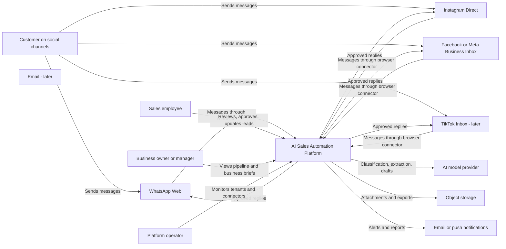

# 01 — System Context

This diagram defines the system boundary. It is intentionally product-level rather than implementation-level.

## Primary actors

### Sales employee

- Reviews incoming conversations.
- Approves or edits AI-generated replies.
- Handles escalated or sensitive messages.
- Updates deal outcomes when automation cannot infer them safely.

### Business owner or manager

- Monitors response times and pipeline health.
- Receives daily AI-generated business summaries.
- Defines approved knowledge, prices, policies, and automation rules.

### Platform operator

- Monitors connector status.
- Handles reauthentication and browser failures.
- Reviews platform-level errors without reading tenant data unless explicitly authorized.

## External dependencies

### Social platforms

The MVP intentionally uses unofficial or browser-driven connectors to reduce initial platform API dependency. This lowers launch friction but increases operational and policy risk. Every connector is therefore treated as replaceable.

### AI provider

The initial implementation can use OpenAI first, but the application talks to an internal AI provider interface so models can be changed by task, cost, or tenant.

### Object storage

Stores attachments, generated quotations, exports, and approved knowledge documents. The relational database stores metadata and references rather than large files.

## Trust boundary

The highest-risk boundary is between external social content and the AI automation layer. Customer messages are untrusted input and must never directly grant the AI permission to invoke unrestricted browser, shell, account, or cross-tenant actions.
