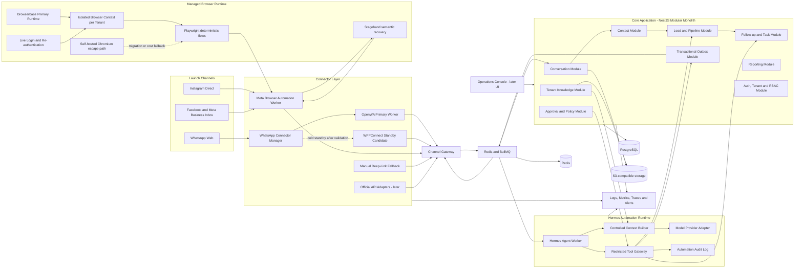

# 02 — Container Architecture

The MVP architecture is a **modular monolith for business logic** plus isolated channel, browser, and AI workers.

The launch channels are:

- WhatsApp through an unofficial connector abstraction.
- Instagram and Facebook through Meta Business Suite browser automation.

TikTok and official platform APIs are deferred until the first paid pilots prove they are needed.

## Why a modular monolith first

The sales domain will change rapidly during customer discovery. Keeping contacts, leads, conversations, tasks, approvals, permissions, knowledge, and reporting in one deployable application reduces coordination cost and makes transactions easier.

The modules still require explicit boundaries and internal contracts. A module may be extracted only when one of the following becomes true:

- It needs independent scaling.
- Its failure mode harms the rest of the application.
- A separate team owns it.
- Its deployment cadence differs significantly.

Browser workers, WhatsApp connector processes, and Hermes workers remain separate processes because they have different reliability, resource, and security boundaries.

## Why connectors are separate processes

OpenWA, WPPConnect, Browserbase sessions, and browser automation have different failure modes from the core application:

- Browser sessions can disconnect or require human login.
- Chromium can crash or consume significant memory.
- A social platform UI change can break one connector while the core remains healthy.
- A WhatsApp Web change can break multiple unofficial libraries.
- Connector workers require independent restart, health, and scaling policies.

A connector failure must not restart, corrupt, or block the modular monolith.

## Browser automation strategy

Browserbase is the selected managed runtime for the first validation phase because it provides hosted browsers, reusable identity contexts, session inspection, and a live login path.

The automation order is:

1. Playwright deterministic workflow.
2. Stagehand semantic action or extraction when the page is ambiguous or changed.
3. Human intervention for login, CAPTCHA, security checks, or uncertain actions.

Browserbase must be accessed through a `BrowserRuntime` interface. A self-hosted Playwright and Chromium implementation remains an escape path for cost, data residency, or platform compatibility reasons.

The free Browserbase allowance is only for prototypes and architecture validation. Usage and cost must be measured per tenant and per workflow before onboarding paid customers.

## WhatsApp connector strategy

The core application depends on a normalized `WhatsAppConnector` contract, not directly on OpenWA.

Selected order:

1. OpenWA as the first working connector.
2. WPPConnect as the first standby candidate to validate.
3. `whatsapp-web.js` as an additional evaluation candidate.
4. Manual deep links as the immediate operational fallback.
5. Official WhatsApp Business Platform adapter later when revenue, reliability, or customer requirements justify it.

Only one unofficial connector may actively control a tenant WhatsApp account at a time. The standby connector is **cold standby** and may require QR re-authentication.

## Proposed MVP stack

| Concern | Selected technology | Role |
|---|---|---|
| Application shape | Modular monolith | One deployable business application with strict module boundaries |
| Core backend | NestJS with Fastify adapter | HTTP, WebSocket, domain modules, policies and integrations |
| Language | TypeScript | Shared contracts across API, workers and connectors |
| Database | PostgreSQL | Transactional source of truth |
| ORM | Prisma | Schema, migrations and typed access |
| Queue and cache | Redis + BullMQ | Jobs, retries, schedules, locks and delayed follow-ups |
| WhatsApp primary | OpenWA adapter | Fast unofficial WhatsApp validation connector |
| WhatsApp standby candidate | WPPConnect adapter | Independently maintained open-source alternative to evaluate |
| Meta channels | Meta Business Suite browser worker | Instagram and Facebook inbox access during validation |
| Browser runtime | Browserbase | Managed sessions, contexts, live login, debugging and replay |
| Browser automation | Playwright | Deterministic primary browser workflows |
| Semantic browser recovery | Stagehand | Recover from ambiguous elements and moderate UI changes |
| AI runtime | Hermes Agent isolated worker | Reasoning, planning and selected automation workflows |
| AI safety boundary | Restricted Tool Gateway | Tenant binding, policy validation and approved action execution |
| Files | MinIO locally, S3-compatible production storage | Portable attachment and knowledge storage |
| Observability | OpenTelemetry-compatible instrumentation | Vendor-neutral logs, metrics and tracing |
| Local development | Docker Compose | Repeatable development and pilot environment |

## Explicit non-goals for the MVP

- Kubernetes.
- Kafka or another event streaming platform.
- Multiple independent business microservices.
- TikTok integration.
- Fully autonomous customer-facing replies.
- Active-active WhatsApp connectors on the same account.
- Direct Hermes access to raw browser sessions or credentials.
- Supporting every social platform at launch.
