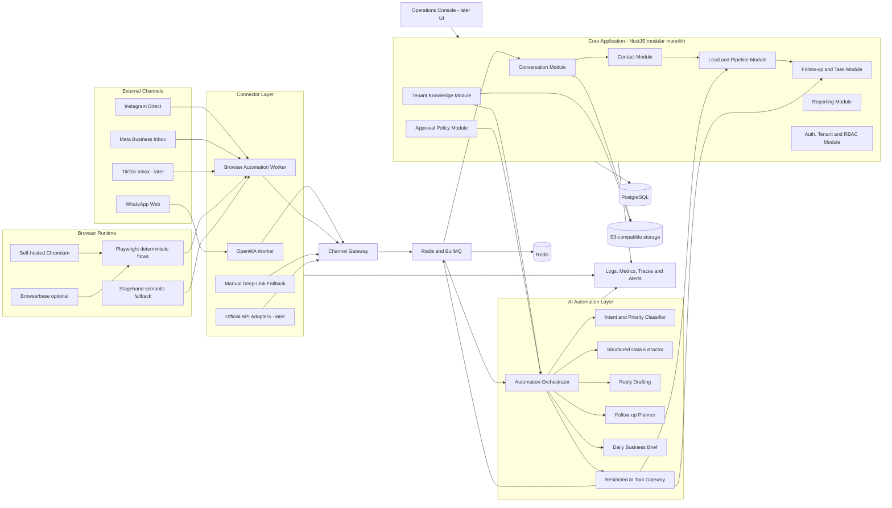

# 02 — Container Architecture

The recommended MVP architecture is a **modular monolith for business logic** plus isolated connector and browser workers.

## Why a modular monolith first

The sales domain will change rapidly during customer discovery. Keeping contacts, leads, conversations, tasks, permissions, and reporting in one deployable application reduces coordination cost and makes transactions easier.

The modules must still have explicit boundaries so they can be separated later if scale or team ownership requires it.

## Why connectors are separate processes

OpenWA and browser automation have different failure modes from the business API:

- Chromium can crash or consume significant memory.
- Sessions can disconnect or require human login.
- A platform UI change can break one connector while the core remains healthy.
- Connector workers may require different scaling and restart policies.

A connector failure must not restart or corrupt the core application.

## Proposed MVP stack

| Concern | Proposed technology | Reason |
|---|---|---|
| Core backend | NestJS with Fastify adapter | Structured modules, dependency injection, WebSocket and worker support |
| Language | TypeScript | Shared contracts across API and workers |
| Database | PostgreSQL | Relational source of truth and transactional consistency |
| ORM | Prisma | Clear schema and migration workflow |
| Queue and cache | Redis + BullMQ | Jobs, retries, schedules, locks and delayed follow-ups |
| WhatsApp | OpenWA adapter | Fast validation without official platform API dependency |
| Browser automation | Playwright | Deterministic primary automation |
| Semantic browser fallback | Stagehand | Recovery from layout changes and ambiguous elements |
| Browser hosting | Self-hosted Chromium first | Lower pilot cost and greater control |
| Managed browser fallback | Browserbase | Optional onboarding, debugging or difficult sessions |
| Files | MinIO locally, S3-compatible production storage | Portable attachment storage |
| Observability | OpenTelemetry-compatible instrumentation | Vendor-neutral tracing and metrics |
| Local deployment | Docker Compose | Repeatable pilot setup |

## Explicit non-goals for the MVP

- Kubernetes.
- Event streaming platforms such as Kafka.
- Multiple independent business microservices.
- Fully autonomous AI replies.
- Always-on Browserbase session for every tenant.
- Supporting every social platform at launch.
