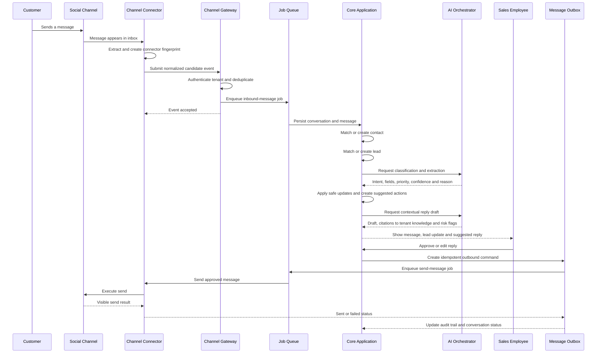

# 03 — Message Lifecycle

This sequence shows the expected inbound message flow for the MVP.

## Inbound processing stages

### 1. Connector detection

The connector discovers an unread or new message and extracts the minimum available information:

- Channel account.
- Conversation reference.
- Sender display name or handle.
- Message text and type.
- Visible timestamp.
- Attachments.
- Connector-specific metadata.

Browser connectors may not expose a stable official message ID. In that case, the connector creates a fingerprint from the channel, account, conversation, sender, normalized content, direction, and time window.

### 2. Gateway validation

The Channel Gateway:

- Confirms that the connector belongs to the tenant.
- Applies rate limits.
- Validates the event schema.
- Performs idempotency checks.
- Stores the raw connector event for replay when appropriate.
- Returns quickly and moves processing to the queue.

### 3. Core persistence

The core application saves the message before AI processing. AI failure must never cause the original message to be lost.

### 4. AI enrichment

The AI layer returns structured output rather than directly mutating the database. Expected fields include:

- Message intent.
- Sales or support category.
- Extracted lead fields.
- Lead temperature.
- Suggested pipeline stage.
- Recommended next action.
- Confidence score.
- Human-readable reasoning.
- Risk flags.

The core validates this output against tenant rules before applying any change.

### 5. Human approval

The first release requires approval before sending customer-facing messages. The employee can approve, edit, reject, or escalate.

### 6. Outbox delivery

Every approved outbound message is saved before sending. The outbox records:

- Tenant and channel account.
- Conversation.
- Approved text or attachment.
- Approval actor.
- Idempotency key.
- Delivery attempts.
- Connector status.
- Final result.

## Failure behavior

### Connector offline

- Keep the outbound item pending.
- Notify the employee.
- Offer a manual deep link when possible.
- Retry only under a bounded policy.

### AI unavailable

- Save and display the original message normally.
- Allow manual lead creation and reply.
- Retry enrichment asynchronously.

### Duplicate browser extraction

- Reject the duplicate through message fingerprints.
- Preserve the raw event for debugging.

### Wrong or low-confidence AI extraction

- Mark fields as suggested rather than confirmed.
- Require employee confirmation for sensitive values such as price, budget, payment, complaint, or cancellation.
