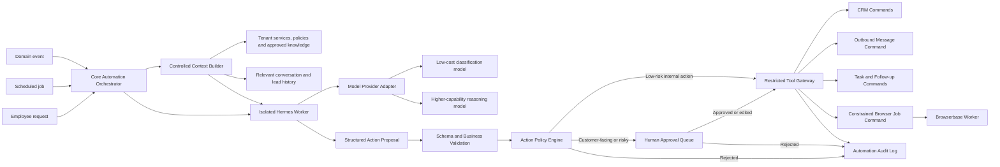

# 04 — Hermes AI Automation Runtime

Hermes is the selected agent runtime for the MVP. It runs as an **isolated automation worker behind the core application**, not as an unrestricted agent with direct access to customer accounts.

The modular monolith remains the source of truth for tenant identity, conversations, leads, pipeline state, permissions, approvals, and audit records.

## Responsibilities

Hermes can:

1. Classify inbound messages.
2. Extract structured lead information.
3. Score urgency and sales potential.
4. Detect missing qualification information.
5. Draft contextual replies.
6. Recommend pipeline changes.
7. Recommend or schedule follow-ups.
8. Summarize conversations.
9. Detect overdue or abandoned opportunities.
10. Produce daily sales operations briefs.
11. Plan multi-step workflows using only approved application tools.

Hermes must not directly:

- Use raw account credentials, cookies, or Browserbase context secrets.
- Access another tenant's context.
- Browse arbitrary websites.
- Control Browserbase or social inboxes through unrestricted browser tools.
- Change passwords or account settings.
- Send unapproved discounts or commitments.
- Delete conversations.
- Execute unrestricted shell commands.
- Run bulk outreach without explicit policy and consent.

## Selected architecture



## Runtime boundary

Hermes receives task-specific context and returns structured proposals. It does not own:

- Tenant authentication.
- Browser sessions.
- Channel credentials.
- The database transaction.
- The message outbox.
- Approval state.
- Business rules.

The core application validates every Hermes action before execution.

## Internal AI interfaces

The business application depends on task-level interfaces rather than Hermes-specific calls:

```ts
interface MessageClassifier {
  classify(input: ClassificationInput): Promise<ClassificationResult>;
}

interface LeadExtractor {
  extract(input: ExtractionInput): Promise<LeadExtractionResult>;
}

interface ReplyDrafter {
  draft(input: ReplyDraftInput): Promise<ReplyDraftResult>;
}

interface FollowUpPlanner {
  plan(input: FollowUpInput): Promise<FollowUpPlan>;
}

interface BusinessBriefGenerator {
  generate(input: DailyBriefInput): Promise<DailyBriefResult>;
}
```

The first implementation uses Hermes behind these interfaces. This preserves the ability to replace or supplement Hermes without rewriting the sales domain.

The model provider remains configurable. Hermes may use OpenAI initially, but the core contracts must not depend directly on one model vendor.

## Hermes tool surface

Hermes receives a small allowlisted toolset such as:

```ts
interface SalesAutomationTools {
  getConversationContext(input: ConversationContextInput): Promise<ConversationContext>;
  proposeLeadUpdate(input: LeadUpdateProposal): Promise<ProposalReceipt>;
  createInternalTask(input: TaskInput): Promise<TaskResult>;
  draftCustomerReply(input: ReplyInput): Promise<ReplyDraft>;
  requestReplyApproval(input: ApprovalInput): Promise<ApprovalResult>;
  requestBrowserJob(input: BrowserJobInput): Promise<BrowserJobReceipt>;
}
```

`requestBrowserJob` accepts only predefined job types, tenant-bound identifiers, and validated arguments. Hermes never receives a general `click`, `navigate`, terminal, or raw Playwright tool in production.

## Automation modes

### Assist mode

- Hermes classifies, extracts, summarizes, and drafts.
- An employee performs or approves every customer-facing action.
- This is the default mode for the first pilot.

### Approval mode

- Hermes prepares database updates, replies, and follow-ups.
- Safe internal updates can execute automatically.
- Customer-facing actions require approval.

### Autopilot mode

- Only approved workflows and templates can execute automatically.
- Each workflow has channel, time, risk, confidence, and volume constraints.
- Autopilot is not part of the first pilot.

## Action risk levels

| Level | Examples | Default policy |
|---|---|---|
| Low | Categorize, tag, summarize, create internal task | Automatic with audit |
| Medium | Change lead stage, assign employee, schedule follow-up | Confidence threshold or approval |
| High | Send customer reply, offer appointment, send quotation | Human approval |
| Critical | Price change, discount, refund, cancellation, legal complaint | Human-only workflow |

## Context construction

Hermes receives only the data required for the current task:

- Tenant ID resolved and enforced outside Hermes.
- Relevant conversation window.
- Current lead and contact fields.
- Approved tenant knowledge.
- Applicable policy and tone.
- Allowed actions for the task.

Hermes must not receive full tenant databases, browser cookies, connector tokens, raw Browserbase context identifiers, or unrelated customer conversations.

## Prompt injection defense

Customer messages are untrusted content. The runtime must:

- Treat message text as data, not runtime instructions.
- Never expose secrets in model context.
- Permit only predefined tools.
- Validate all tool arguments server-side.
- Bind every action to a tenant and authenticated automation run.
- Reject attempts to navigate arbitrary URLs or modify system configuration.
- Record context references, model output, policy decision, approval, and action outcome.
- Require explicit approval for new tool types or new autonomous workflows.

## Cost controls

- Run rule-based checks before Hermes or model calls.
- Batch classification when appropriate.
- Use smaller models for common extraction and classification tasks.
- Use higher-capability models only for ambiguous or valuable cases.
- Cache approved tenant knowledge retrieval.
- Limit conversation history by relevance.
- Track AI cost per tenant, workflow, channel, and successful business outcome.
- Allow AI features to degrade gracefully when a tenant reaches a cost limit.

## Selected decision

Hermes is accepted as the first agent runtime under these constraints:

- The core application owns state and policy.
- Hermes runs as an isolated worker.
- Hermes has no direct account credentials or unrestricted browser access.
- Every proposed action passes through typed validation and the Restricted Tool Gateway.
- Model provider access remains behind an adapter.

See `decisions/ADR-003-hermes-agent-runtime.md`.
