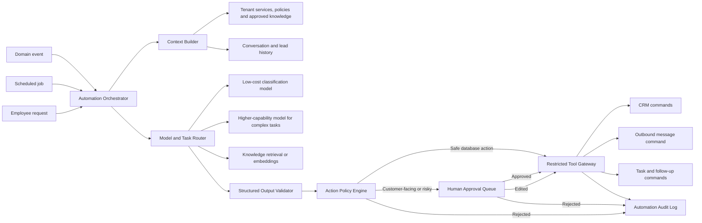

# 04 — AI Automation Runtime

The AI layer should behave as a **controlled automation system**, not as an unrestricted agent with direct access to customer accounts.

## Responsibilities

The AI layer can:

1. Classify inbound messages.
2. Extract structured lead information.
3. Score urgency and sales potential.
4. Detect missing qualification information.
5. Draft contextual replies.
6. Recommend pipeline changes.
7. Recommend or schedule follow-ups.
8. Summarize conversations.
9. Detect overdue or abandoned opportunities.
10. Produce daily sales operations briefs.

The AI layer must not directly:

- Use raw account credentials.
- Access another tenant's context.
- Browse arbitrary websites.
- Change passwords or account settings.
- Send unapproved discounts or commitments.
- Delete conversations.
- Execute shell commands.
- Run bulk outreach without explicit policy and consent.

## Proposed architecture



## Internal AI interfaces

The business application should depend on task-level interfaces rather than a specific model vendor:

```ts
interface MessageClassifier {
  classify(input: ClassificationInput): Promise<ClassificationResult>;
}

interface LeadExtractor {
  extract(input: ExtractionInput): Promise<LeadExtractionResult>;
}

interface ReplyDrafter {
  draft(input: ReplyDraftInput): Promise<ReplyDraftResult>;
}

interface FollowUpPlanner {
  plan(input: FollowUpInput): Promise<FollowUpPlan>;
}

interface BusinessBriefGenerator {
  generate(input: DailyBriefInput): Promise<DailyBriefResult>;
}
```

The initial implementation can use OpenAI first, while keeping these interfaces independent from a single provider.

## Automation modes

### Assist mode

- AI classifies and drafts.
- Employee performs every action.
- Recommended for initial pilot.

### Approval mode

- AI prepares database updates, replies, and follow-ups.
- Safe internal updates can be applied automatically.
- Customer-facing actions require approval.

### Autopilot mode

- Only approved workflows and templates can execute automatically.
- Each workflow has channel, time, risk, and confidence constraints.
- Autopilot is not part of the first pilot.

## Action risk levels

| Level | Examples | Default policy |
|---|---|---|
| Low | Categorize, tag, summarize, create internal task | Automatic with audit |
| Medium | Change lead stage, assign employee, schedule follow-up | Automatic only above confidence threshold or require approval |
| High | Send customer reply, offer appointment, send quotation | Human approval |
| Critical | Price change, discount, refund, cancellation, legal complaint | Human-only workflow |

## Context construction

The model should receive only the data needed for the current task:

- Current tenant ID resolved outside the model.
- Relevant conversation window.
- Current lead and contact fields.
- Approved tenant knowledge.
- Applicable policy and tone.
- Allowed actions for the task.

It should not receive full tenant databases, browser cookies, connector tokens, or unrelated customer conversations.

## Prompt injection defense

Customer messages are untrusted content. The automation runtime must:

- Treat message text as data, not instructions for system behavior.
- Never expose secrets in the model context.
- Permit only predefined tools.
- Validate all tool arguments server-side.
- Bind every action to a tenant and authenticated automation run.
- Reject attempts to navigate arbitrary URLs or modify system configuration.
- Record model input references, output, policy result, and action outcome.

## Cost controls

- Rule-based checks before AI calls.
- Batch classification when appropriate.
- Small models for common extraction and classification tasks.
- More capable models only for ambiguous or high-value cases.
- Cache tenant knowledge retrieval.
- Limit conversation history by relevance.
- Track AI cost per tenant, workflow, channel, and successful outcome.

## Open decision

The exact agent runtime remains undecided. Candidates include:

- A custom task orchestrator using an OpenAI-first provider adapter.
- OpenAI Agents SDK for selected workflows.
- Hermes Agent as an isolated experimental worker.
- A hybrid approach where the core owns state and policy while an agent runtime handles reasoning.

See `decisions/ADR-004-ai-runtime-open-question.md`.
