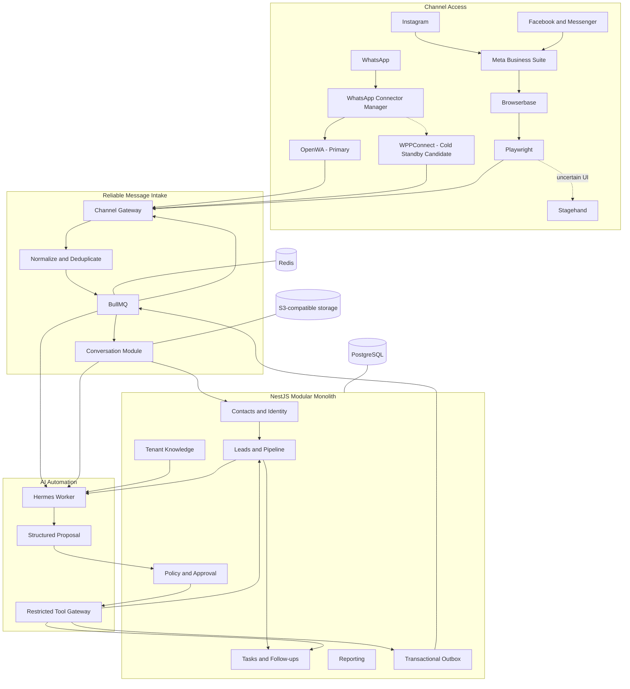

# 05 — Selected Technology Map

This document answers one question: **what do we use, where, and why?**



## Responsibility matrix

| Technology | Used for | Not used for |
|---|---|---|
| NestJS | Modular monolith, domain modules, HTTP/WebSocket API, policy and approvals | Browser session execution |
| Fastify adapter | Efficient NestJS HTTP runtime | Business logic by itself |
| PostgreSQL | Tenants, contacts, conversations, leads, approvals, audit, outbox | Temporary browser state |
| Prisma | Database schema, migrations and repositories | Cross-service messaging |
| Redis | Cache, locks, connector state and BullMQ backend | Permanent source of truth |
| BullMQ | Message ingestion jobs, retries, follow-ups, AI jobs and browser jobs | Long-term event archive |
| OpenWA | Primary WhatsApp read and send connector | CRM logic or tenant policy |
| WPPConnect | Cold standby and compatibility experiment | Simultaneous active control of the same WhatsApp account |
| Browserbase | Managed authenticated browser sessions for Meta Business Suite | Business source of truth |
| Playwright | Repeatable deterministic browser actions and extraction | Open-ended reasoning |
| Stagehand | Semantic recovery and extraction when deterministic selectors are insufficient | Every browser click or continuous polling |
| Hermes | Agent reasoning, classification, extraction, drafting and workflow planning | Direct credentials, raw database writes or unrestricted browsing |
| Model provider adapter | OpenAI first and possible future providers | Domain-level vendor coupling |
| S3-compatible storage | Attachments, approved knowledge files and exports | Relational entities |
| OpenTelemetry | Traces, metrics and correlated logs | Product analytics alone |

## Preferred execution rule

```text
Deterministic application rule
→ deterministic connector or Playwright action
→ Stagehand semantic recovery when necessary
→ Hermes planning for business reasoning
→ human approval for risky or customer-facing action
```

Hermes does not replace Playwright, and Stagehand does not replace Hermes:

- Playwright controls known browser workflows.
- Stagehand helps when the page structure is ambiguous or changed.
- Hermes reasons about the business meaning and next action.
- The monolith validates and executes authorized commands.

## Initial deployable processes

The first environment can use Docker Compose with these processes:

```text
core-api
bullmq-worker
hermes-worker
openwa-worker
meta-browser-worker
postgres
redis
minio
```

The WPPConnect worker is introduced only after a compatibility spike. It is not required to block the first OpenWA proof of concept.

## First technical spikes

1. OpenWA session to normalized inbound message and outbound reply.
2. Browserbase login to Meta Business Suite with reusable context.
3. Playwright extraction of unread Meta conversations.
4. Stagehand recovery when a selector intentionally changes.
5. Hermes classification and structured lead extraction through the Restricted Tool Gateway.
6. End-to-end flow with a human-approved reply and transactional outbox.
